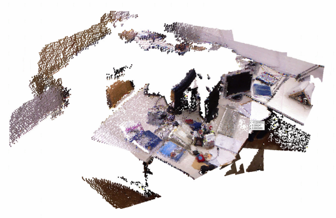

> We are adding a few final touches, and this repo should be _stable_ shortly!


--------------------------------------------------------------------------------
gradslam is a fully differentiable dense SLAM framework. It provides a repository of differentiable building blocks for a dense SLAM system, such as differentiable nonlinear least squares solvers, differentiable ICP (iterative closest point) techniques, differentiable raycasting modules, and differentiable mapping/fusion blocks. One can use these blocks to construct SLAM systems that allow gradients to flow all the way from the outputs of the system (map, trajectory) to the inputs (raw color/depth images, parameters, calibration, etc.).

[](https://opensource.org/licenses/MIT) [](https://circleci.com/gh/gradslam/gradslam/tree/master) [](https://gradslam.readthedocs.io/en/latest/?badge=latest)


<p align="center">
	
</p> 


- [Overview](#overview)
- [Installation](#installation)
- Tutorials (coming soon)
- [Online Documentation](https://gradslam.readthedocs.io/en/latest/)
- Contributing to GradSLAM (coming soon)


## Overview

```python
rgbdimages = RGBDImages(colors, depths, intrinsics)
slam = PointFusion()
pointclouds, recovered_poses = slam(rgbdimages)
pointclouds.plotly(0).show()
```


## Installation

### Requirements
- `pytorch>=1.6.0` (for other pytorch versions see [here](#install-with-other-pytorch-versions) )

### Using pip (not functional yet)

`pip install gradslam`

### Install from GitHub

`pip install 'git+https://github.com/gradslam/gradslam.git'`

### Install from local clone (Recommended)

```
git clone https://github.com/gradslam/gradslam.git
cd gradslam
pip install -e .
```

### Install with other pytorch versions
```
git clone https://github.com/krrish94/chamferdist.git
cd chamferdist
pip install .
cd ..
git clone https://github.com/gradslam/gradslam.git
cd gradslam
pip install -e .
```

### Verifying the installation

To verify if `gradslam` has successfully been built, fire up the python interpreter, and import!

```py
import gradslam as gs
print(gs.__version__)
```

You should see the version number displayed.


## Citing gradslam

If you find `gradslam` useful in your work, and are writing up a report/paper about us, we'd appreciate if you cited us. Please use the following bibtex entry.

```
@inproceedings{gradslam,
  title={gradSLAM: Dense SLAM meets automatic differentiation},
  author={{Krishna Murthy}, Jatavallabhula and Saryazdi, Soroush and Iyer, Ganesh and Paull, Liam},
  booktitle={arXiv},
  year={2020},
}
```


## Contributors

* Soroush Saryazdi
* Krishna Murthy Jatavallabhula
* Ganesh Iyer
